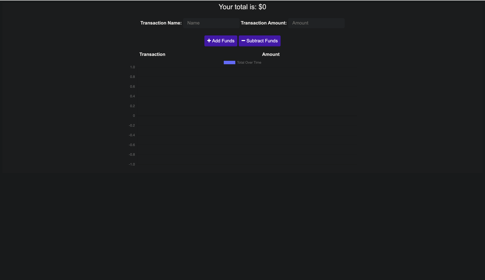
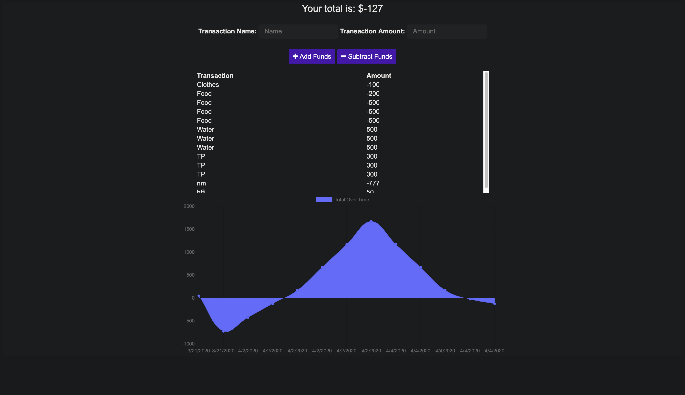

# Budget-Tracker

## Table of contents

- [Deployed Repo](#deployed-repo)
- [Assignment Info](#assignment-info)
- [Technologies](#technologies)
- [Running Pages](#running-pages)
- [Key Notes](#key-notes)

## Deployed Repo

- HTML
  https://budget-tracker-2020.herokuapp.com/

## Assignment info

For this assignment we were given majority of the front end
code. Only needing to add a bootstrap link to the header in
the (index.html) and a script call to register the service 
worker. For the back end we needed to add our manfest json 
and a service worker. Sending files to be cached and having
the application run offline then update everything done once
back online.

## Technologies

Project is created with:

- Bootstrap v4.4
- Visual Studios Code (HTML/CSS/JS/JQ)
- Google/W3
- Node.js
- Express
- NPM
- MongoDB
- Mongod

## Running Pages

- Here's screen shots of the running page from an images folder:





## Key Notes

- Bootstrap link for html format

```
    <link
      rel="stylesheet"
      href="https://stackpath.bootstrapcdn.com/font-awesome/4.7.0/css/font-awesome.min.css"
    />
```

- Have mongod running in a separate terminal before running app local

- NPM

* install
* express
* start

- Mongod
- Mongo
